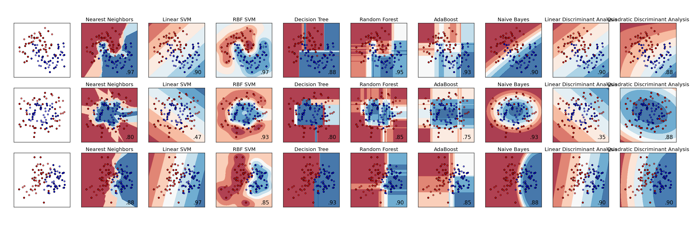
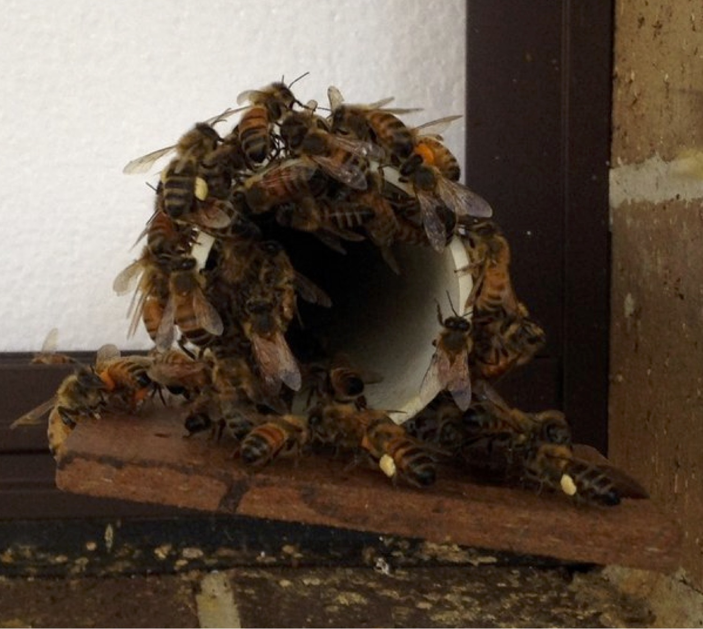

# Machine Learning Workshop

## Aim

The aim of this workshop is to introduce the basics of machine learning with Python and scikit-learn.

## Workshop Structure

1. [Workshop dataset](dataset.md)
2. [Introducing machine learning](intro.md)
3. [Image and feature analysis](images_features.md)
4. [Building a machine learning program](training_testing.md)
5. [Putting it all together and validating](pipelines_validation.md)

## Learning Objectives

The aim of this workshop is to provide participants with the following skills:

* Data manipulation to feed your machine learning algorithm
* Choosing features for your particular problem
* Organising your data
* Clustering your data
* Training a support vector machine classification program
* Building a pipeline from preprocessing to final classification
* Choosing the parameters of your classifier
* Validating your approach

## Dataset

The data used for this workshop come in the form of images of tags on the backs of honeybees which were filmed as part of an experiment into bee behaviour. We are interested in training a machine learning algorithm to automatically classify the different types of tag automatically. More information is available in the [workshop dataset](dataset.md) section of the workshop materials.

## Software Installation

We will be demonstrating using scikit-learn 0.17 on Python 3.5. Our demonstrations will be in a Jupyter notebook. Here are two ways to install these packages. Note that older versions may work, but they have not been tested.

Installing a numerical stack for Python is getting easier all the time, but can still be tricky. We give two recipes below, one using the Conda package manager and one for pip in a virtual environment.

### Conda/Miniconda (Recommended)

We recommend the Anaconda distribution for this workshop [(located here).](https://www.continuum.io/downloads). The default Anaconda environment includes everything we need for this workshop. An alternative is [Miniconda](http://conda.pydata.org/miniconda.html), but you will need to create an environment following the instructions below.

    # After installing conda or miniconda
    conda create -n pyconau_ml python=3.5 scikit-learn jupyter matplotlib
    source activate pyconau_ml

    # Activate the Conda environment on Windows:
    activate pyconau_ml

Note that jupyter and matplotlib are included because we will be demonstrating from a jupyter notebook and using matplotlib to show some images and some graphs. You are of course welcome to work in whatever environment you feel comfortable.

### Pip in a virtual environment

Alternatively, you can use pip in a virtual environment:

    # Setup a virtual env
    /path/to/python35 -m venv pyconau_ml
    source pyconau_ml/bin/activate
    python -m pip install --upgrade pip
    python -m pip install numpy scipy scikit-learn jupyter matplotlib

Note the pip upgrade is necessary so Linux distributions will use precompiled wheels (see the [manylinux](https://github.com/pypa/manylinux) project for details). With a pip version older than 8.1 numpy and scikit-learn will be installed from source.

## Workshop Materials and Dataset

This workshop is hosted [here](https://github.com/alistairwalsh/MLD.git). Cloning this repository will give you the full workshop content, including the notes, the jupyter notebook we will be presenting from and the workshop dataset in raw and preprocessed formats.

    git clone https://github.com/alistairwalsh/MLD.git

## Testing Your Installation

Inside the workshop repository you cloned:

    jupyter notebook demonstration_notebook.ipynb

Running the first cell (placing the cursor inside the cell and hitting ctrl-enter) should succesfully import all of the installed libraries.

If you're not running in the jupyter notebook, if the following works you are ready:

    import numpy as np
    import sklearn
    import matplotlib.pyplot as plt

    images, labels = np.load('path/to/data.npz')
