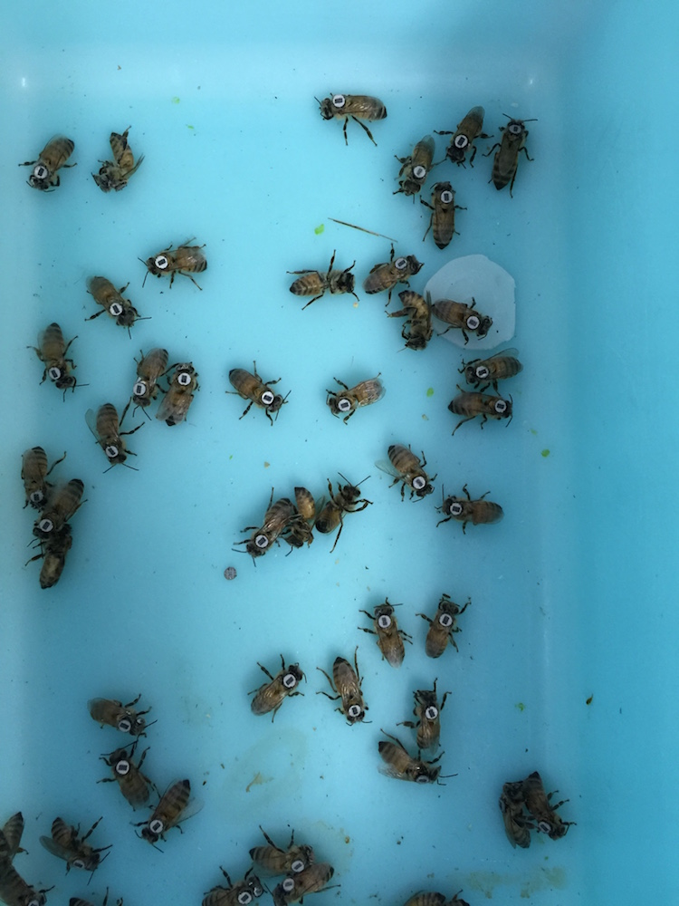
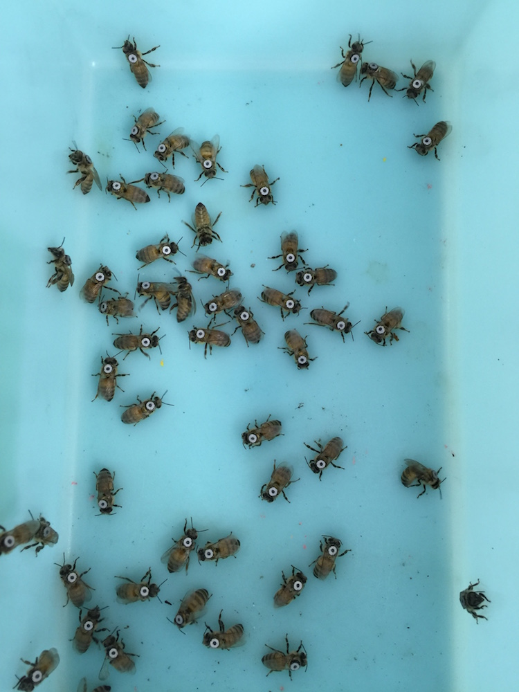
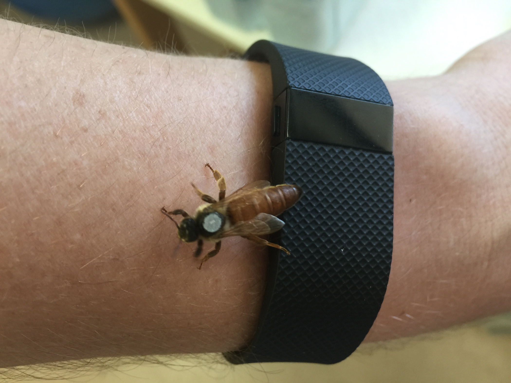
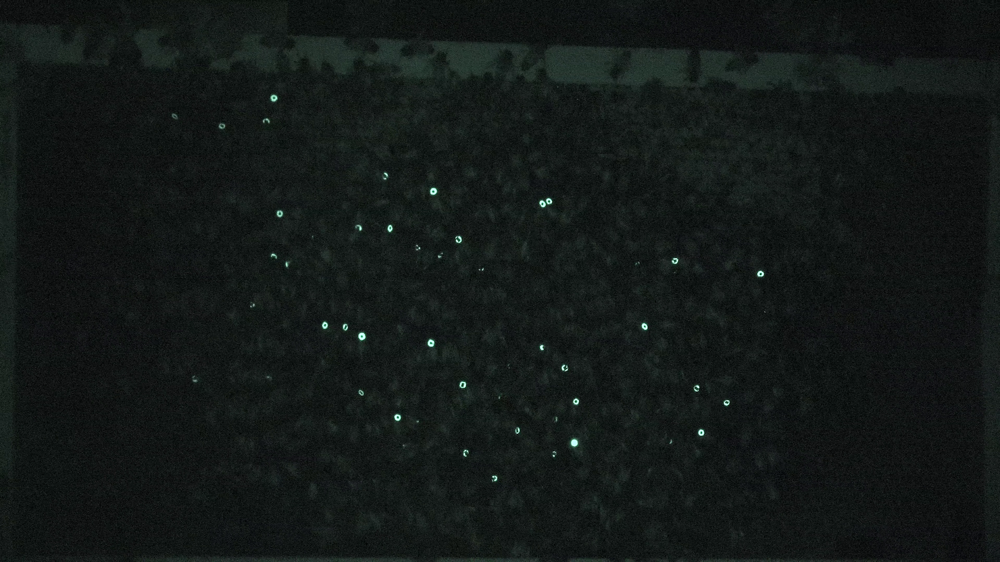

# Machine Learning with Python

These materials will provide a practical introduction to commonly used machine learning techniques, using data from a real research project into honeybee behaviour that was solved with machine learning.

## Classifying Honeybee Tags

The data explored during this workshop come from a research project where honeybees were tagged with reflective markers and filmed using an infrared light for 24 hours a day for over two weeks. Three different types of tag were used:

Tag Number             |  Pattern   | Details
:-------------------------:|:-------------------------: | :-------------------------:
1  |  Rectangle | 100 bees that were not exposed to any drugs:
2  |  Circle    | 100 bees that were treated with caffeine:
3  | Blank      | Single queen in the colony received this tag:

This is what the tags looked like before we added them to the colony:

Control Tags             |  Treatment Tags
:-------------------------:|:-------------------------:
  |  

Queen Tag             |
:-------------------------:|
  |

This is how the tags appeared in the video we filmed over the course of the experiment

Experiment Footage             |
:-------------------------:|
  |

We're interested in distinguishing the three tagged groups of bees in the footage from this experiment. There is far too many videos and bees to be able to do this ourselves, so we'll try to train a machine learning algorithm to perform this classification task for us.

## Libraries

We'll be using the following Python libraries throught this workshop:

* scikit-learn: Machine learning library
* OpenCV: Image processing library
* NumPy: Matrix manipulation library
* Matplotlib: For generating figures and plots
