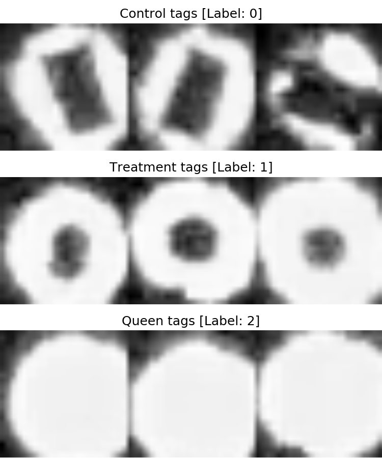

# Machine learning

Let's look at our problem again:

You might already be thinking of how to solve this. One approach would be to manually construct a set of rules based on properties of the images. For example:

- If there are dark pixels in the middle the image is not of a queen tag
- If there are more than x dark pixels in the centre of the image it's a control tag, otherwise it's a treatment tag.

When you implement this kind of logic you end up with a decision tree:

	def classify_tag(image):

		if middle_is_dark(image):

			if number_dark_pixels(images) > 42:
				return 'Control'

			else:
				return 'Treatment'

		else:
			return 'Queen'

This is a perfectly reasonable way to approach many problems - in fact in many cases we have a logical starting point for what we want like a documented API or a clear specification. For problems like this one however, there is no standard. We have a messy set of data with many complex interactions: tags can be any oriented in any way because bees can move in any direction, the tags are not perfectly centred in our 24 pixel crops and so on. 

It's feasible to individually examine the 730 images in the dataset and make a reasonable set of rules to solve the problem. But what if there are 7,300 images, or 7,300,000. How can you capture the complexity and implicit rules of a dataset like that?

Machine learning approaches aim to automate the 'rule' discovery above. A machine learning algorithm takes a set of data like the above and generates a set of rules to fit that data.

There are two main types of machine learning:

### Supervised

Supervised learning occurs when you have a dataset and a set of labels describing the data that you can train the computer with.

The example we're working with today is a supervised classification problem: we have labels for the images.

### Unsupervised

Unsupervised learning occurs when you have a dataset without any labels and you wish to look at the patterns within the data.

Even when you do have labelled data, unsupervised learning can be a useful first step for when you want to visualise your dataset.
